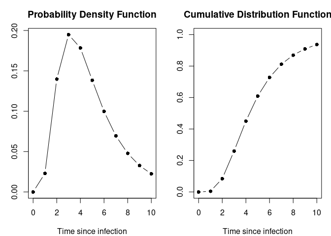
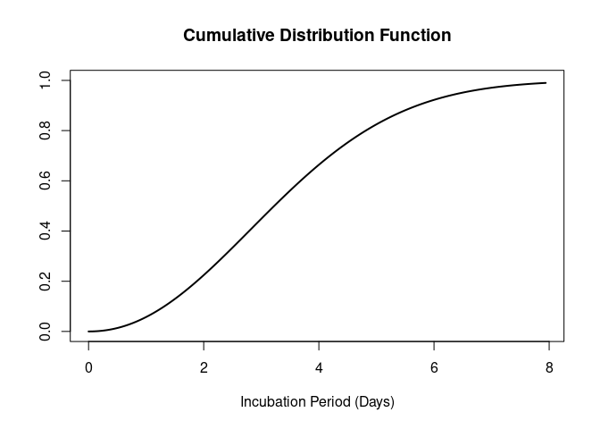

<!-- README.md is generated from README.Rmd. Please edit that file -->

# epiparameter 

<!-- badges: start -->

[](https://opensource.org/licenses/MIT)
[](https://github.com/epiverse-trace/epiparameter/actions/workflows/R-CMD-check.yaml)
[](https://app.codecov.io/gh/epiverse-trace/epiparameter?branch=main)
[](https://lifecycle.r-lib.org/articles/stages.html#experimental)
[](https://doi.org/10.5281/zenodo.11110881)
<!-- badges: end -->

`{epiparameter}` is an `R` package that contains a library of
epidemiological parameters for infectious diseases and a set classes and
helper functions to be able to work with the data. It also includes
functions to extract and convert parameters from reported summary
statistics.

`{epiparameter}` is developed at the [Centre for the Mathematical
Modelling of Infectious
Diseases](https://www.lshtm.ac.uk/research/centres/centre-mathematical-modelling-infectious-diseases)
at the [London School of Hygiene and Tropical
Medicine](https://www.lshtm.ac.uk/) as part of
[Epiverse-TRACE](https://data.org/initiatives/epiverse/).

## Installation

The easiest way to install the development version of `{epiparameter}`
is to use the `{pak}` package:

``` r
# check whether {pak} is installed
if(!require("pak")) install.packages("pak")
pak::pak("epiverse-trace/epiparameter")
```

## Quick start

``` r
library(epiparameter)
```

To load the library of epidemiological parameters into `R`:

``` r
epidists <- epidist_db()
#> Returning 122 results that match the criteria (99 are parameterised). 
#> Use subset to filter by entry variables or single_epidist to return a single entry. 
#> To retrieve the citation for each use the 'get_citation' function
```

``` r
epidists
#> List of <epidist> objects
#>   Number of entries in library: 122
#>   Number of studies in library: 47
#>   Number of diseases: 23
#>   Number of delay distributions: 112
#>   Number of offspring distributions: 10
```

This results a list of database entries. Each entry of the library is an
`<epidist>` object.

The results can be filtered by disease and epidemiological distribution.
Here we set `single_epidist = TRUE` as we only want a single database
entry returned, and by default (`single_epidist = FALSE`) it will return
all database entries that match the disease (`disease`) and
epidemiological distribution (`epi_dist`).

``` r
influenza_incubation <- epidist_db(
  disease = "influenza",
  epi_dist = "incubation period",
  single_epidist = TRUE
)
#> Using Virlogeux V, Li M, Tsang T, Feng L, Fang V, Jiang H, Wu P, Zheng J, Lau
#> E, Cao Y, Qin Y, Liao Q, Yu H, Cowling B (2015). "Estimating the
#> Distribution of the Incubation Periods of Human Avian Influenza A(H7N9)
#> Virus Infections." _American Journal of Epidemiology_.
#> doi:10.1093/aje/kwv115 <https://doi.org/10.1093/aje/kwv115>.. 
#> To retrieve the citation use the 'get_citation' function
```

``` r
influenza_incubation
#> Disease: Influenza
#> Pathogen: Influenza-A-H7N9
#> Epi Distribution: incubation period
#> Study: Virlogeux V, Li M, Tsang T, Feng L, Fang V, Jiang H, Wu P, Zheng J, Lau
#> E, Cao Y, Qin Y, Liao Q, Yu H, Cowling B (2015). "Estimating the
#> Distribution of the Incubation Periods of Human Avian Influenza A(H7N9)
#> Virus Infections." _American Journal of Epidemiology_.
#> doi:10.1093/aje/kwv115 <https://doi.org/10.1093/aje/kwv115>.
#> Distribution: weibull
#> Parameters:
#>   shape: 2.101
#>   scale: 3.839
```

The `<epidist>` object can be plotted.

``` r
plot(influenza_incubation)
```



The CDF can also be plotted by setting `cumulative = TRUE`.

``` r
plot(influenza_incubation, cumulative = TRUE)
```



### Parameter conversion and extraction

The parameters of a distribution can be converted to and from mean and
standard deviation. In `{epiparameter}` we implement this for a variety
of distributions:

- gamma
- lognormal
- Weibull
- negative binomial
- geometric

The parameters of a probability distribution can also be extracted from
other summary statistics, for example, percentiles of the distribution,
or the median and range of the data. This can be done for:

- gamma
- lognormal
- Weibull
- normal

## Contributing to library of epidemiological parameters

If you would like to contribute to the different epidemiological
parameters stored in the `{epiparameter}` package, you can add data to a
public [google
sheet](https://docs.google.com/spreadsheets/d/1zVpaaKkQ7aeMdRN2r0p-W4d2TtccL5HcIOp_w-lfkEQ/edit?usp=sharing).
This spreadsheet contains two example entries as a guide to what fields
can accept. We are monitoring this sheet for new entries that will
subsequently be included in the package.

Alternatively, parameters can be added to the [JSON file holding the
data](https://github.com/epiverse-trace/epiparameter/blob/main/inst/extdata/parameters.json)
base directly via a Pull Request.

You can find explanation of accepted entries for each column in the
[data
dictionary](https://github.com/epiverse-trace/epiparameter/blob/main/inst/extdata/data_dictionary.json).

## Help

To report a bug please open an
[issue](https://github.com/epiverse-trace/epiparameter/issues/new/choose)

## Contribute

Contributions to `{epiparameter}` are welcomed. [package contributing
guide](https://github.com/epiverse-trace/.github/blob/main/CONTRIBUTING.md).

## Code of Conduct

Please note that the `{epiparameter}` project is released with a
[Contributor Code of
Conduct](https://github.com/epiverse-trace/.github/blob/main/CODE_OF_CONDUCT.md).
By contributing to this project, you agree to abide by its terms.

## Citing this package

``` r
citation("epiparameter")
#> To cite package 'epiparameter' in publications use:
#> 
#>   Lambert J, Kucharski A, Tamayo C (2024). _epiparameter: Library of
#>   Epidemiological Parameters with Helper Functions and Classes_.
#>   doi:10.5281/zenodo.11110881
#>   <https://doi.org/10.5281/zenodo.11110881>,
#>   <https://github.com/epiverse-trace/epiparameter/,https://epiverse-trace.github.io/epiparameter/>.
#> 
#> A BibTeX entry for LaTeX users is
#> 
#>   @Manual{,
#>     title = {epiparameter: Library of Epidemiological Parameters with Helper Functions and Classes},
#>     author = {Joshua W. Lambert and Adam Kucharski and Carmen Tamayo},
#>     year = {2024},
#>     doi = {10.5281/zenodo.11110881},
#>     url = {https://github.com/epiverse-trace/epiparameter/,
#> https://epiverse-trace.github.io/epiparameter/},
#>   }
```
