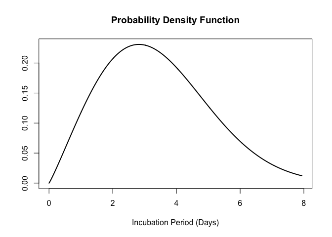
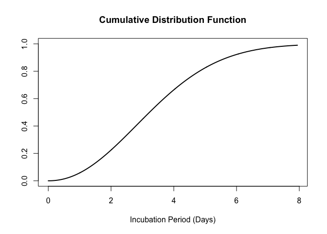

<!-- README.md is generated from README.Rmd. Please edit that file -->

# epiparameter 

<!-- badges: start -->

[](https://opensource.org/licenses/MIT)
[](https://github.com/epiverse-trace/epiparameter/actions/workflows/R-CMD-check.yaml)
[](https://app.codecov.io/gh/epiverse-trace/epiparameter?branch=main)
[](https://lifecycle.r-lib.org/articles/stages.html#experimental)
[](https://doi.org/10.5281/zenodo.11110881)
<!-- badges: end -->

`{epiparameter}` is an `R` package that contains a library of
epidemiological parameters for infectious diseases as well as classes
and helper functions to work with the data. It also includes functions
to extract and convert parameters from reported summary statistics.

`{epiparameter}` is developed at the [Centre for the Mathematical
Modelling of Infectious
Diseases](https://www.lshtm.ac.uk/research/centres/centre-mathematical-modelling-infectious-diseases)
at the [London School of Hygiene and Tropical
Medicine](https://www.lshtm.ac.uk/) as part of
[Epiverse-TRACE](https://data.org/initiatives/epiverse/).

## Installation

The easiest way to install the development version of `{epiparameter}`
is to use the `{pak}` package:

``` r
# check whether {pak} is installed
if(!require("pak")) install.packages("pak")
pak::pak("epiverse-trace/epiparameter")
```

Alternatively, install pre-compiled binaries from [the Epiverse TRACE
R-universe](https://epiverse-trace.r-universe.dev/epiparameter)

``` r
install.packages("epiparameter", repos = c("https://epiverse-trace.r-universe.dev", "https://cloud.r-project.org"))
```

## Quick start

``` r
library(epiparameter)
```

To load the library of epidemiological parameters into `R`:

``` r
epiparameters <- epiparameter_db()
#> Returning 125 results that match the criteria (100 are parameterised). 
#> Use subset to filter by entry variables or single_epiparameter to return a single entry. 
#> To retrieve the citation for each use the 'get_citation' function
epiparameters
#> # List of 125 <epiparameter> objects
#> Number of diseases: 23
#> ❯ Adenovirus ❯ Chikungunya ❯ COVID-19 ❯ Dengue ❯ Ebola Virus Disease ❯ Hantavirus Pulmonary Syndrome ❯ Human Coronavirus ❯ Influenza ❯ Japanese Encephalitis ❯ Marburg Virus Disease ❯ Measles ❯ MERS ❯ Mpox ❯ Parainfluenza ❯ Pneumonic Plague ❯ Rhinovirus ❯ Rift Valley Fever ❯ RSV ❯ SARS ❯ Smallpox ❯ West Nile Fever ❯ Yellow Fever ❯ Zika Virus Disease
#> Number of epi parameters: 13
#> ❯ case fatality risk ❯ generation time ❯ hospitalisation to death ❯ hospitalisation to discharge ❯ incubation period ❯ notification to death ❯ notification to discharge ❯ offspring distribution ❯ onset to death ❯ onset to discharge ❯ onset to hospitalisation ❯ onset to ventilation ❯ serial interval
#> [[1]]
#> Disease: Adenovirus
#> Pathogen: Adenovirus
#> Epi Parameter: incubation period
#> Study: Lessler J, Reich N, Brookmeyer R, Perl T, Nelson K, Cummings D (2009).
#> "Incubation periods of acute respiratory viral infections: a systematic
#> review." _The Lancet Infectious Diseases_.
#> doi:10.1016/S1473-3099(09)70069-6
#> <https://doi.org/10.1016/S1473-3099%2809%2970069-6>.
#> Distribution: lnorm
#> Parameters:
#>   meanlog: 1.723
#>   sdlog: 0.231
#> 
#> [[2]]
#> Disease: Human Coronavirus
#> Pathogen: Human_Cov
#> Epi Parameter: incubation period
#> Study: Lessler J, Reich N, Brookmeyer R, Perl T, Nelson K, Cummings D (2009).
#> "Incubation periods of acute respiratory viral infections: a systematic
#> review." _The Lancet Infectious Diseases_.
#> doi:10.1016/S1473-3099(09)70069-7
#> <https://doi.org/10.1016/S1473-3099%2809%2970069-7>.
#> Distribution: lnorm
#> Parameters:
#>   meanlog: 1.163
#>   sdlog: 0.140
#> 
#> [[3]]
#> Disease: SARS
#> Pathogen: SARS-Cov-1
#> Epi Parameter: incubation period
#> Study: Lessler J, Reich N, Brookmeyer R, Perl T, Nelson K, Cummings D (2009).
#> "Incubation periods of acute respiratory viral infections: a systematic
#> review." _The Lancet Infectious Diseases_.
#> doi:10.1016/S1473-3099(09)70069-8
#> <https://doi.org/10.1016/S1473-3099%2809%2970069-8>.
#> Distribution: lnorm
#> Parameters:
#>   meanlog: 1.386
#>   sdlog: 0.593
#> 
#> # ℹ 122 more elements
#> # ℹ Use `print(n = ...)` to see more elements.
#> # ℹ Use `parameter_tbl()` to see a summary table of the parameters.
#> # ℹ Explore database online at: https://epiverse-trace.github.io/epiparameter/articles/database.html
```

This results in a list of database entries. Each entry of the library is
an `<epiparameter>` object.

Alternatively, the library of epiparameters can be viewed as a vignette
locally (`vignette("database", package = "epiparameter")`) or on the
[{epiparameter}
website](https://epiverse-trace.github.io/epiparameter/articles/database.html).

The results can be filtered by disease and epidemiological distribution.
Here we set `single_epiparameter = TRUE` as we only want a single
database entry returned, and by default (`single_epiparameter = FALSE`)
it will return all database entries that match the disease (`disease`)
and epidemiological parameter (`epi_name`).

``` r
influenza_incubation <- epiparameter_db(
  disease = "influenza",
  epi_name = "incubation period",
  single_epiparameter = TRUE
)
#> Using Virlogeux V, Li M, Tsang T, Feng L, Fang V, Jiang H, Wu P, Zheng J, Lau
#> E, Cao Y, Qin Y, Liao Q, Yu H, Cowling B (2015). "Estimating the
#> Distribution of the Incubation Periods of Human Avian Influenza A(H7N9)
#> Virus Infections." _American Journal of Epidemiology_.
#> doi:10.1093/aje/kwv115 <https://doi.org/10.1093/aje/kwv115>.. 
#> To retrieve the citation use the 'get_citation' function
influenza_incubation
#> Disease: Influenza
#> Pathogen: Influenza-A-H7N9
#> Epi Parameter: incubation period
#> Study: Virlogeux V, Li M, Tsang T, Feng L, Fang V, Jiang H, Wu P, Zheng J, Lau
#> E, Cao Y, Qin Y, Liao Q, Yu H, Cowling B (2015). "Estimating the
#> Distribution of the Incubation Periods of Human Avian Influenza A(H7N9)
#> Virus Infections." _American Journal of Epidemiology_.
#> doi:10.1093/aje/kwv115 <https://doi.org/10.1093/aje/kwv115>.
#> Distribution: weibull
#> Parameters:
#>   shape: 2.101
#>   scale: 3.839
```

To quickly view the list of epidemiological distributions returned by
`epiparameter_db()` in a table, the `parameter_tbl()` gives a summary of
the data, and offers the ability to subset you data by `disease`,
`pathogen` and epidemiological parameter (`epi_name`).

``` r
parameter_tbl(epiparameters)
#> # Parameter table:
#> # A data frame:    125 × 7
#>    disease          pathogen epi_name prob_distribution author  year sample_size
#>    <chr>            <chr>    <chr>    <chr>             <chr>  <dbl>       <dbl>
#>  1 Adenovirus       Adenovi… incubat… lnorm             Lessl…  2009          14
#>  2 Human Coronavir… Human_C… incubat… lnorm             Lessl…  2009          13
#>  3 SARS             SARS-Co… incubat… lnorm             Lessl…  2009         157
#>  4 Influenza        Influen… incubat… lnorm             Lessl…  2009         151
#>  5 Influenza        Influen… incubat… lnorm             Lessl…  2009          90
#>  6 Influenza        Influen… incubat… lnorm             Lessl…  2009          78
#>  7 Measles          Measles… incubat… lnorm             Lessl…  2009          55
#>  8 Parainfluenza    Parainf… incubat… lnorm             Lessl…  2009          11
#>  9 RSV              RSV      incubat… lnorm             Lessl…  2009          24
#> 10 Rhinovirus       Rhinovi… incubat… lnorm             Lessl…  2009          28
#> # ℹ 115 more rows
parameter_tbl(
  epiparameters,
  epi_name = "onset to hospitalisation"
)
#> # Parameter table:
#> # A data frame:    5 × 7
#>   disease  pathogen   epi_name        prob_distribution author  year sample_size
#>   <chr>    <chr>      <chr>           <chr>             <chr>  <dbl>       <dbl>
#> 1 MERS     MERS-Cov   onset to hospi… <NA>              Assir…  2013          23
#> 2 COVID-19 SARS-CoV-2 onset to hospi… gamma             Linto…  2020         155
#> 3 COVID-19 SARS-CoV-2 onset to hospi… gamma             Linto…  2020          34
#> 4 COVID-19 SARS-CoV-2 onset to hospi… lnorm             Linto…  2020         155
#> 5 COVID-19 SARS-CoV-2 onset to hospi… lnorm             Linto…  2020          34
```

The `<epiparameter>` object can be plotted.

``` r
plot(influenza_incubation)
```



The CDF can also be plotted by setting `cumulative = TRUE`.

``` r
plot(influenza_incubation, cumulative = TRUE)
```



### Parameter conversion and extraction

The parameters of a distribution can be converted to and from mean and
standard deviation. In `{epiparameter}` we implement this for a variety
of distributions:

- gamma
- lognormal
- Weibull
- negative binomial
- geometric

The parameters of a probability distribution can also be extracted from
other summary statistics, for example, percentiles of the distribution,
or the median and range of the data. This can be done for:

- gamma
- lognormal
- Weibull
- normal

## Contributing to library of epidemiological parameters

If you would like to contribute to the different epidemiological
parameters stored in the `{epiparameter}` package, you can add data to a
public [google
sheet](https://docs.google.com/spreadsheets/d/1eCL3n_woseg5Npu7XD7TcuNoLUIhMBu8ZoLCkVdATUE/edit?usp=sharing).
This spreadsheet contains two example entries as a guide to what fields
can accept. We are monitoring this sheet for new entries that will
subsequently be included in the package.

Alternatively, parameters can be added to the [JSON file holding the
data](https://github.com/epiverse-trace/epiparameter/blob/main/inst/extdata/parameters.json)
base directly via a Pull Request.

You can find explanation of accepted entries for each column in the
[data
dictionary](https://github.com/epiverse-trace/epiparameter/blob/main/inst/extdata/data_dictionary.json).

## Help

To report a bug please open an
[issue](https://github.com/epiverse-trace/epiparameter/issues/new/choose)

## Contribute

Contributions to `{epiparameter}` are welcomed. [package contributing
guide](https://github.com/epiverse-trace/.github/blob/main/CONTRIBUTING.md).

## Code of Conduct

Please note that the `{epiparameter}` project is released with a
[Contributor Code of
Conduct](https://github.com/epiverse-trace/.github/blob/main/CODE_OF_CONDUCT.md).
By contributing to this project, you agree to abide by its terms.

## Citing this package

``` r
citation("epiparameter")
#> To cite package 'epiparameter' in publications use:
#> 
#>   Lambert J, Kucharski A, Tamayo C (2024). _epiparameter: Library of
#>   Epidemiological Parameters with Helper Functions and Classes_.
#>   doi:10.5281/zenodo.11110881
#>   <https://doi.org/10.5281/zenodo.11110881>,
#>   <https://epiverse-trace.github.io/epiparameter>.
#> 
#> A BibTeX entry for LaTeX users is
#> 
#>   @Manual{,
#>     title = {epiparameter: Library of Epidemiological Parameters with Helper Functions and Classes},
#>     author = {Joshua W. Lambert and Adam Kucharski and Carmen Tamayo},
#>     year = {2024},
#>     doi = {10.5281/zenodo.11110881},
#>     url = {https://epiverse-trace.github.io/epiparameter},
#>   }
```
