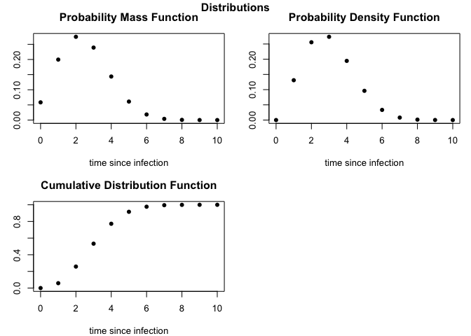

<!-- README.md is generated from README.Rmd. Please edit that file -->

# epiparameter

<!-- badges: start -->

[](https://opensource.org/licenses/MIT)
[](https://github.com/epiverse-trace/epiparameter/actions/workflows/R-CMD-check.yaml)
[](https://app.codecov.io/gh/epiverse-trace/epiparameter?branch=main)
<!-- badges: end -->

`R` package with epidemiological parameter distributions for infectious
diseases. It includes functions that load delay distributions for a
range of pathogens and functions to extract parameters from reported
statistics.

## Installation

The easiest way to install the development version of `epiparameter` is
to use the `devtools` package:

``` r
# install.packages("devtools")
library(devtools)
install_github("epiverse-trace/epiparameter")
library(epiparameter)
```

## Quick start

To view the available distributions, then define the desired function,
e.g. to extract and plot the daily probability mass function for the
incubation period of influenza H7N9:

``` r
# View available distributions
epiparameter::list_distributions(delay_dist = "incubation")
#>             pathogen_id        study_id year size distribution
#> 1            adenovirus    Lessler_etal 2009   14        lnorm
#> 2                 ebola        WHO_team 2014  500        gamma
#> 3             human_CoV    Lessler_etal 2009   13        lnorm
#> 4  influenza_A_seasonal    Lessler_etal 2009  122        lnorm
#> 5  influenza_B_seasonal    Lessler_etal 2009   76        lnorm
#> 6       influenza_H1N1p      Ghani_etal 2009   16        gamma
#> 7       influenza_H1N1p      Tuite_etal 2010  316        lnorm
#> 8        influenza_H7N9    Cowling_etal 2013   32        gamma
#> 9               marburg    Martini_etal 1973    5        gamma
#> 10              measles    Lessler_etal 2009   56        lnorm
#> 11             MERS_CoV Cauchemez_et_al 2014    7        lnorm
#> 12             MERS_CoV     Assiri_etal 2013   23        lnorm
#> 13        parainfluenza    Lessler_etal 2009   11        lnorm
#> 14           rhinovirus    Lessler_etal 2009   28        lnorm
#> 15                  RSV    Lessler_etal 2009   24        lnorm
#> 16             SARS_CoV   Donnelly_etal 2003   57        gamma
#> 17             SARS_CoV    Lessler_etal 2009  157        lnorm
#> 18  SARS_CoV_2_wildtype    McAloon_etal 2020 1269        lnorm
#> 19            monkeypox           Nolen 2016   16        lnorm

# Extract incubation period distribution
incubation_H7N9 <- epiparameter::epidist(
  pathogen = "influenza_H7N9", 
  delay_dist = "incubation"
)

# Plot probability distributions
plot(incubation_H7N9)
```



## `epiparameter` tutorial with applications

For a full explanation of the functions and data stored in the
`epiparameter` package and a few possible applications of the delay
distribution data please see the [introduction to
`epiparameter`](https://epiverse-trace.github.io/epiparameter/articles/epiparameter.html).

## Contributing to library of delay distributions

If you would like to contribute to the different delay distributions
stored in the `epiparameter` package, you can access the [google
sheet](https://docs.google.com/spreadsheets/d/1VzC8NFHSQYPKsiDnxA7gDsm4cVr79outKQZJP8cC7Ro/edit?usp=sharing)
and add your data.

Notes on the the spreadsheet:

-   Most studies will report the distribution(s) they fitted to the
    data. In the case that the study did not report the distribution of
    the reported parameters or summary statistics (mean and standard
    deviation of the distribution) the distribution can be assumed
    (e.g. by looking at the shape of the distribution from figures in
    the paper). When a distribution is being assumed and not explicitly
    stated please add this assumption to the notes section of the
    spreadsheet. We are only interested in studies that report the
    distribution fitted to the data. This will ensure that if this data
    is used in another application the user can be alerted that the
    distribution is assumed and not known with certainty.

-   Shape and scale columns are the parameters of the gamma
    distribution, while meanlog and sdlog columns are the parameters of
    the lognormal distribution. In some cases these values will not be
    reported in the study but can be extracted using the `epiparameter`
    function `extract_param()` using either reported percentiles or
    median and range (see [extraction section](#extraction))

-   The extracted column refers to whether the distribution parameters
    are explicitly stated in the paper, in which case the extracted
    column should be “no”, or are extracted from summary statistics
    using function in the package, in which case the extracted column is
    “yes”

-   Discretised is to indicate whether the study fitted a discrete
    distribution

-   Phase_bias means the study adjusted for a either a rising or falling
    epidemic, which can bias incubation period estimates. Most studies
    will not adjust for this bias.

If fields are not known from a study, either put “NA” or “not yet
checked”. We are also happy to receive papers which report these delay
distributions and can add them to the database ourselves.

## Help

To report a bug please open an
[issue](https://github.com/epiverse-trace/epiparameter/issues/new/choose)

## Contribute

Contributions to `epiparameter` are welcomed. Please follow the [package
contributing
guide](https://github.com/epiverse-trace/epiparameter/blob/main/.github/CONTRIBUTING.md).

## Code of Conduct

Please note that the DAISIEprep project is released with a [Contributor
Code of
Conduct](https://contributor-covenant.org/version/2/0/CODE_OF_CONDUCT.html).
By contributing to this project, you agree to abide by its terms.
