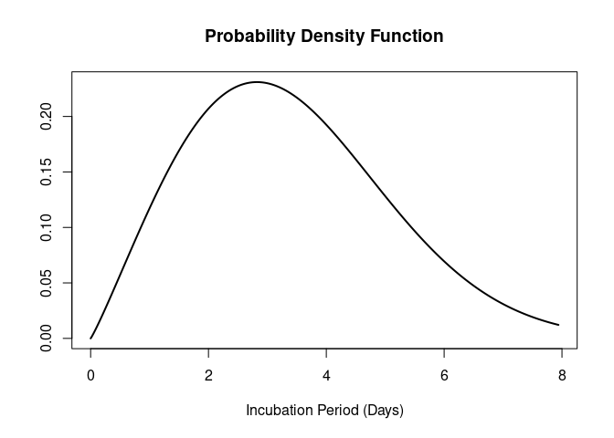

<!-- README.md is generated from README.Rmd. Please edit that file -->

# epiparameter 

<!-- badges: start -->

[](https://opensource.org/licenses/MIT)
[](https://github.com/epiverse-trace/epiparameter/actions/workflows/R-CMD-check.yaml)
[](https://app.codecov.io/gh/epiverse-trace/epiparameter?branch=main)
<!-- badges: end -->

`{epiparameter}` is an `R` package that contains a library of
epidemiological parameters for infectious diseases and a set classes and
helper functions to be able to work with the data. It also includes
functions to extract and convert parameters from reported summary
statistics.

`{epiparameter}` is developed at the [Centre for the Mathematical
Modelling of Infectious
Diseases](https://www.lshtm.ac.uk/research/centres/centre-mathematical-modelling-infectious-diseases)
at the London School of Hygiene and Tropical Medicine as part of the
[Epiverse Initiative](https://data.org/initiatives/epiverse/).

## Installation

The easiest way to install the development version of `{epiparameter}`
is to use the `{remotes}` package:

``` r
# check whether {remotes} is installed
if(!require("remotes")) install.packages("remotes")
remotes::install_github("epiverse-trace/epiparameter")
```

## Quick start

``` r
library(epiparameter)
```

To load the library of epidemiological parameters into `R`:

``` r
eparams <- epiparam()
eparams
#> Epiparam object
#> Number of distributions in library: 54
#> Number of diseases: 21
#> Number of delay distributions: 45
#> Number of offspring distributions: 9
#> Number of studies in library: 24
#> <Head of library>
#>       disease  epi_distribution prob_distribution
#> 1  adenovirus incubation_period         lognormal
#> 2 chikungunya incubation_period         lognormal
#> 3      dengue incubation_period         lognormal
#> 4      dengue incubation_period         lognormal
#> 5      dengue incubation_period         lognormal
#> 6      dengue incubation_period         lognormal
#> <48 more rows & 53 more cols not shown>
```

The library is an `<epiparam>` class, which underneath is a data frame.

Each entry of the library can be converted into an `<epidist>` object to
be used.

``` r
influenza_incubation <- as_epidist(eparams[12, ])
influenza_incubation
#> Disease: influenza
#> Pathogen: influenza-A-H1N1pdm
#> Epi Distribution: incubation period
#> Study: Ghani et al. (2009) <10.1371/currents.RRN1130> PMID: 20029668
#> Distribution: gamma
#> Parameters:
#>   shape: 17.503123698459
#>   rate: 8.5381091211995
```

The `<epidist>` object can be plotted.

``` r
plot(influenza_incubation)
```



### Parameter conversion and extraction

The parameters of a distribution can be converted to and from mean and
standard deviation. In `{epiparameter}` we implement this for a variety
of distributions:

- gamma
- lognormal
- weibull
- negative binomial
- geometric

The parameters of a probability distribution can also be extracted from
other summary statistics, for example, percentiles of the distribution,
or the median and range of the data. This can be done for:

- gamma
- lognormal
- weibull

## `{epiparameter}` tutorial with applications

For a full explanation of the functions and data stored in the
`epiparameter` package and a few possible applications of the delay
distribution data please see the [introduction to
`epiparameter`](https://epiverse-trace.github.io/epiparameter/articles/epiparameter.html).

## Contributing to library of epidemiological parameters

If you would like to contribute to the different epidemiological
parameters stored in the `{epiparameter}` package, you can access the
[google
sheet](https://docs.google.com/spreadsheets/d/1zVpaaKkQ7aeMdRN2r0p-W4d2TtccL5HcIOp_w-lfkEQ/edit?usp=sharing)
and add your data. This spreadsheet contains two example entries as a
guide to what fields can accept. See also the data dictionary (either
yaml or JSON files) in the`{epiparameter}` package (in inst/extdata) for
explanation of accepted entries for each column.

## Help

To report a bug please open an
[issue](https://github.com/epiverse-trace/epiparameter/issues/new/choose)

## Contribute

Contributions to `{epiparameter}` are welcomed. Please follow the
[package contributing
guide](https://github.com/epiverse-trace/epiparameter/blob/main/.github/CONTRIBUTING.md).

## Code of Conduct

Please note that the `{epiparameter}` project is released with a
[Contributor Code of
Conduct](https://github.com/epiverse-trace/.github/blob/main/CODE_OF_CONDUCT.md).
By contributing to this project, you agree to abide by its terms.

## Citing this package

``` r
citation("epiparameter")
#> 
#> To cite package 'epiparameter' in publications use:
#> 
#>   Kucharski A (2023). _epiparameter: Library of epidemiological
#>   parameters_. https://github.com/epiverse-trace/epiparameter,
#>   https://epiverse-trace.github.io/epiparameter/.
#> 
#> A BibTeX entry for LaTeX users is
#> 
#>   @Manual{,
#>     title = {epiparameter: Library of epidemiological parameters},
#>     author = {Adam Kucharski},
#>     year = {2023},
#>     note = {https://github.com/epiverse-trace/epiparameter,
#> https://epiverse-trace.github.io/epiparameter/},
#>   }
```
