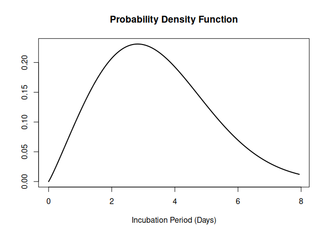
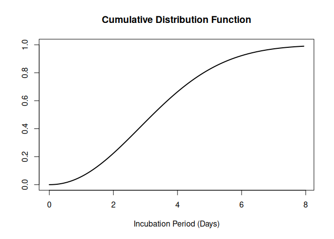

# epiparameter

[epiparameter](https://github.com/epiverse-trace/epiparameter/) is an
`R` package that contains a library of epidemiological parameters for
infectious diseases as well as classes and helper functions to work with
the data. It also includes functions to extract and convert parameters
from reported summary statistics.

[epiparameter](https://github.com/epiverse-trace/epiparameter/) is
developed at the [Centre for the Mathematical Modelling of Infectious
Diseases](https://www.lshtm.ac.uk/research/centres/centre-mathematical-modelling-infectious-diseases)
at the [London School of Hygiene and Tropical
Medicine](https://www.lshtm.ac.uk/) as part of
[Epiverse-TRACE](https://data.org/initiatives/epiverse/).

## Installation

The package can be installed from CRAN using

``` r

install.packages("epiparameter")
```

The development version of
[epiparameter](https://github.com/epiverse-trace/epiparameter/) can be
installed from [GitHub](https://github.com/epiverse-trace/epiparameter)
using the [pak](https://pak.r-lib.org/) package:

``` r

# check whether {pak} is installed
if(!require("pak")) install.packages("pak")
pak::pak("epiverse-trace/epiparameter")
```

Alternatively, install pre-compiled binaries from [the Epiverse TRACE
R-universe](https://epiverse-trace.r-universe.dev/epiparameter)

``` r

install.packages("epiparameter", repos = c("https://epiverse-trace.r-universe.dev", "https://cloud.r-project.org"))
```

## Quick start

``` r

library(epiparameter)
```

To load the library of epidemiological parameters into `R`:

``` r

epiparameters <- epiparameter_db()
#> Returning 133 results that match the criteria (108 are parameterised). 
#> Use subset to filter by entry variables or single_epiparameter to return a single entry. 
#> To retrieve the citation for each use the 'get_citation' function
epiparameters
#> # List of 133 <epiparameter> objects
#> Number of diseases: 23
#> ❯ Adenovirus ❯ Chikungunya ❯ COVID-19 ❯ Dengue ❯ Ebola Virus Disease ❯ Hantavirus Pulmonary Syndrome ❯ Human Coronavirus ❯ Influenza ❯ Japanese Encephalitis ❯ Marburg Virus Disease ❯ Measles ❯ MERS ❯ Mpox ❯ Parainfluenza ❯ Pneumonic Plague ❯ Rhinovirus ❯ Rift Valley Fever ❯ RSV ❯ SARS ❯ Smallpox ❯ West Nile Fever ❯ Yellow Fever ❯ Zika Virus Disease
#> Number of epi parameters: 13
#> ❯ case fatality risk ❯ generation time ❯ hospitalisation to death ❯ hospitalisation to discharge ❯ incubation period ❯ notification to death ❯ notification to discharge ❯ offspring distribution ❯ onset to death ❯ onset to discharge ❯ onset to hospitalisation ❯ onset to ventilation ❯ serial interval
#> [[1]]
#> Disease: Adenovirus
#> Pathogen: Adenovirus
#> Epi Parameter: incubation period
#> Study: Lessler J, Reich N, Brookmeyer R, Perl T, Nelson K, Cummings D (2009).
#> "Incubation periods of acute respiratory viral infections: a systematic
#> review." _The Lancet Infectious Diseases_.
#> doi:10.1016/S1473-3099(09)70069-6
#> <https://doi.org/10.1016/S1473-3099%2809%2970069-6>.
#> Distribution: lnorm (days)
#> Parameters:
#>   meanlog: 1.723
#>   sdlog: 0.231
#> 
#> [[2]]
#> Disease: Human Coronavirus
#> Pathogen: Human Coronavirus
#> Epi Parameter: incubation period
#> Study: Lessler J, Reich N, Brookmeyer R, Perl T, Nelson K, Cummings D (2009).
#> "Incubation periods of acute respiratory viral infections: a systematic
#> review." _The Lancet Infectious Diseases_.
#> doi:10.1016/S1473-3099(09)70069-6
#> <https://doi.org/10.1016/S1473-3099%2809%2970069-6>.
#> Distribution: lnorm (days)
#> Parameters:
#>   meanlog: 1.163
#>   sdlog: 0.140
#> 
#> [[3]]
#> Disease: SARS
#> Pathogen: SARS-CoV-1
#> Epi Parameter: incubation period
#> Study: Lessler J, Reich N, Brookmeyer R, Perl T, Nelson K, Cummings D (2009).
#> "Incubation periods of acute respiratory viral infections: a systematic
#> review." _The Lancet Infectious Diseases_.
#> doi:10.1016/S1473-3099(09)70069-6
#> <https://doi.org/10.1016/S1473-3099%2809%2970069-6>.
#> Distribution: lnorm (days)
#> Parameters:
#>   meanlog: 1.386
#>   sdlog: 0.593
#> 
#> # ℹ 130 more elements
#> # ℹ Use `print(n = ...)` to see more elements.
#> # ℹ Use `parameter_tbl()` to see a summary table of the parameters.
#> # ℹ Explore database online at: https://epiverse-trace.github.io/epiparameter/articles/database.html
```

This results in a list of database entries. Each entry of the library is
an `<epiparameter>` object.

Alternatively, the library of epiparameters can be viewed as a vignette
locally
([`vignette("database", package = "epiparameter")`](https://epiverse-trace.github.io/epiparameter/dev/articles/database.md))
or on the [{epiparameter}
website](https://epiverse-trace.github.io/epiparameter/articles/database.html).

The results can be filtered by disease and epidemiological distribution.
Here we set `single_epiparameter = TRUE` as we only want a single
database entry returned, and by default (`single_epiparameter = FALSE`)
it will return all database entries that match the disease (`disease`)
and epidemiological parameter (`epi_name`).

``` r

influenza_incubation <- epiparameter_db(
  disease = "influenza",
  epi_name = "incubation period",
  single_epiparameter = TRUE
)
#> Using Virlogeux V, Li M, Tsang T, Feng L, Fang V, Jiang H, Wu P, Zheng J, Lau
#> E, Cao Y, Qin Y, Liao Q, Yu H, Cowling B (2015). "Estimating the
#> Distribution of the Incubation Periods of Human Avian Influenza A(H7N9)
#> Virus Infections." _American Journal of Epidemiology_.
#> doi:10.1093/aje/kwv115 <https://doi.org/10.1093/aje/kwv115>.. 
#> To retrieve the citation use the 'get_citation' function
influenza_incubation
#> Disease: Influenza
#> Pathogen: Influenza-A-H7N9
#> Epi Parameter: incubation period
#> Study: Virlogeux V, Li M, Tsang T, Feng L, Fang V, Jiang H, Wu P, Zheng J, Lau
#> E, Cao Y, Qin Y, Liao Q, Yu H, Cowling B (2015). "Estimating the
#> Distribution of the Incubation Periods of Human Avian Influenza A(H7N9)
#> Virus Infections." _American Journal of Epidemiology_.
#> doi:10.1093/aje/kwv115 <https://doi.org/10.1093/aje/kwv115>.
#> Distribution: weibull (days)
#> Parameters:
#>   shape: 2.101
#>   scale: 3.839
```

To quickly view the list of epidemiological distributions returned by
[`epiparameter_db()`](https://epiverse-trace.github.io/epiparameter/dev/reference/epiparameter_db.md)
in a table, the
[`parameter_tbl()`](https://epiverse-trace.github.io/epiparameter/dev/reference/parameter_tbl.md)
gives a summary of the data, and offers the ability to subset you data
by `disease`, `pathogen` and epidemiological parameter (`epi_name`).

``` r

parameter_tbl(epiparameters)
#> # Parameter table:
#> # A data frame:    133 × 7
#>    disease          pathogen epi_name prob_distribution author  year sample_size
#>    <chr>            <chr>    <chr>    <chr>             <chr>  <dbl>       <dbl>
#>  1 Adenovirus       Adenovi… incubat… lnorm             Lessl…  2009          14
#>  2 Human Coronavir… Human C… incubat… lnorm             Lessl…  2009          13
#>  3 SARS             SARS-Co… incubat… lnorm             Lessl…  2009         157
#>  4 Influenza        Influen… incubat… lnorm             Lessl…  2009         151
#>  5 Influenza        Influen… incubat… lnorm             Lessl…  2009          90
#>  6 Influenza        Influen… incubat… lnorm             Lessl…  2009          78
#>  7 Measles          Measles… incubat… lnorm             Lessl…  2009          55
#>  8 Parainfluenza    Parainf… incubat… lnorm             Lessl…  2009          11
#>  9 RSV              RSV      incubat… lnorm             Lessl…  2009          24
#> 10 Rhinovirus       Rhinovi… incubat… lnorm             Lessl…  2009          28
#> # ℹ 123 more rows
parameter_tbl(
  epiparameters,
  epi_name = "onset to hospitalisation"
)
#> # Parameter table:
#> # A data frame:    5 × 7
#>   disease  pathogen   epi_name        prob_distribution author  year sample_size
#>   <chr>    <chr>      <chr>           <chr>             <chr>  <dbl>       <dbl>
#> 1 MERS     MERS-CoV   onset to hospi… <NA>              Assir…  2013          23
#> 2 COVID-19 SARS-CoV-2 onset to hospi… gamma             Linto…  2020         155
#> 3 COVID-19 SARS-CoV-2 onset to hospi… gamma             Linto…  2020          34
#> 4 COVID-19 SARS-CoV-2 onset to hospi… lnorm             Linto…  2020         155
#> 5 COVID-19 SARS-CoV-2 onset to hospi… lnorm             Linto…  2020          34
```

The `<epiparameter>` object can be plotted.

``` r

plot(influenza_incubation)
```



The CDF can also be plotted by setting `cumulative = TRUE`.

``` r

plot(influenza_incubation, cumulative = TRUE)
```



### Parameter conversion and extraction

The parameters of a distribution can be converted to and from mean and
standard deviation. In
[epiparameter](https://github.com/epiverse-trace/epiparameter/) we
implement this for a variety of distributions:

- gamma
- lognormal
- Weibull
- negative binomial
- geometric
- normal

The parameters of a probability distribution can also be extracted from
other summary statistics, for example, percentiles of the distribution,
or the median and range of the data. This can be done for:

- gamma
- lognormal
- Weibull
- normal

## Contributing to library of epidemiological parameters

The library of epidemiological parameters that can be loaded by
[epiparameter](https://github.com/epiverse-trace/epiparameter/) using
the
[`epiparameter_db()`](https://epiverse-trace.github.io/epiparameter/dev/reference/epiparameter_db.md)
function is stored in the [`{epiparameterDB}` R
package](https://github.com/epiverse-trace/epiparameterDB). To
contribute an entry, add it to the [JSON file holding the
database](https://github.com/epiverse-trace/epiparameterDB/blob/main/inst/extdata/parameters.json)
via a pull request to that repository. The [Epiverse-TRACE contributing
guide](https://github.com/epiverse-trace/.github/blob/main/CONTRIBUTING.md)
covers the pull request process; the format of an entry is described in
the [Epidemiological parameter data
sources](https://epiverse-trace.github.io/epiparameter/articles/data_sources.html)
vignette.

The library is a development and experimentation set rather than a
comprehensive repository. It stores parameters needed by
[epiparameter](https://github.com/epiverse-trace/epiparameter/), another
Epiverse-TRACE package or a tutorial that are not available elsewhere.
Parameters intended for long-term curation are better contributed to
[grEPI](https://who-collaboratory.github.io/collaboratory-grepi-web/) or
[`{epireview}`](https://mrc-ide.github.io/epireview/) directly.

You can find a description of the epidemiological parameter data
structure and contents in the [data
dictionary](https://github.com/epiverse-trace/epiparameterDB/blob/main/inst/extdata/data_dictionary.json).
This documents the valid format and data types to ensure consistency and
accuracy. All entries in the parameter library are automatically
validated against the data dictionary using an GitHub action workflow.

## Help

To report a bug please open an
[issue](https://github.com/epiverse-trace/epiparameter/issues/new/choose)

## Contribute

Contributions to
[epiparameter](https://github.com/epiverse-trace/epiparameter/) are
welcomed. [package contributing
guide](https://github.com/epiverse-trace/.github/blob/main/CONTRIBUTING.md).

## Code of Conduct

Please note that the
[epiparameter](https://github.com/epiverse-trace/epiparameter/) project
is released with a [Contributor Code of
Conduct](https://github.com/epiverse-trace/.github/blob/main/CODE_OF_CONDUCT.md).
By contributing to this project, you agree to abide by its terms.

## Citing this package

``` r

citation("epiparameter")
#> To cite package 'epiparameter' in publications use:
#> 
#>   Lambert J, Kucharski A, Tamayo Cuartero C (2026). _epiparameter:
#>   Classes and Helper Functions for Working with Epidemiological
#>   Parameters_. doi:10.5281/zenodo.11110881
#>   <https://doi.org/10.5281/zenodo.11110881>.
#>   <https://epiverse-trace.github.io/epiparameter/>.
#> 
#> A BibTeX entry for LaTeX users is
#> 
#>   @Manual{,
#>     title = {epiparameter: Classes and Helper Functions for Working with Epidemiological Parameters},
#>     author = {Joshua W. Lambert and Adam Kucharski and Carmen {Tamayo Cuartero}},
#>     year = {2026},
#>     doi = {10.5281/zenodo.11110881},
#>     url = {https://epiverse-trace.github.io/epiparameter/},
#>   }
```

## Related projects

[epiparameter](https://github.com/epiverse-trace/epiparameter/) provides
classes and helper functions for working with epidemiological
parameters. It is not the only source of already-estimated parameters:

- [`{epiparameterDB}`](https://CRAN.R-project.org/package=epiparameterDB)
  holds the library of epidemiological parameters loaded by
  [`epiparameter_db()`](https://epiverse-trace.github.io/epiparameter/dev/reference/epiparameter_db.md).

- [`{epireview}`](https://mrc-ide.github.io/epireview/) provides
  parameters for a range of pathogens extracted from the literature by
  the Pathogen Epidemiology Review Group (PERG) in systematic reviews.
  Its parameter tables can be converted with
  [`as_epiparameter()`](https://epiverse-trace.github.io/epiparameter/dev/reference/as_epiparameter.md),
  as described in the [Using {epireview} with
  {epiparameter}](https://epiverse-trace.github.io/epiparameter/articles/data_from_epireview.html)
  article.

- grEPI, the Global Epidemiological Parameters database hosted on the
  [WHO Collaboratory](https://collaboratory.who.int/), can be queried
  directly with `epiparameter_db(db = "grEPI")`.

[epiparameter](https://github.com/epiverse-trace/epiparameter/) also
does not estimate parameters from data. The following packages do, and
are intended to be used alongside
[epiparameter](https://github.com/epiverse-trace/epiparameter/):

- [`{primarycensored}`](https://primarycensored.epinowcast.org/) fits
  delay distributions while accounting for primary event censoring,
  secondary event interval censoring and right truncation. It extends
  [`{fitdistrplus}`](https://CRAN.R-project.org/package=fitdistrplus),
  and is a good starting point when fitting delays to individual-level
  data.

- [`{epidist}`](https://epidist.epinowcast.org/) estimates
  epidemiological delay distributions in a Bayesian framework, also
  accounting for censoring and truncation.

- [`{EpiNow2}`](https://epiforecasts.io/EpiNow2/) provides
  `estimate_delay()` for fitting delay distributions, and
  `estimate_truncation()` for estimating and adjusting for right
  truncation.

- [`{fitdistrplus}`](https://CRAN.R-project.org/package=fitdistrplus) is
  a general-purpose distribution fitting package. It does not handle
  discretisation, censoring or truncation itself, so for epidemiological
  delays it is best used through
  [primarycensored](https://primarycensored.epinowcast.org).

- [`{epitrix}`](https://www.repidemicsconsortium.org/epitrix/) provides
  `fit_disc_gamma()` for fitting a discretised gamma distribution.

Estimates obtained from completed delays alone can be subject to
epidemic phase bias and right truncation, so we recommend the packages
above that account for these.
